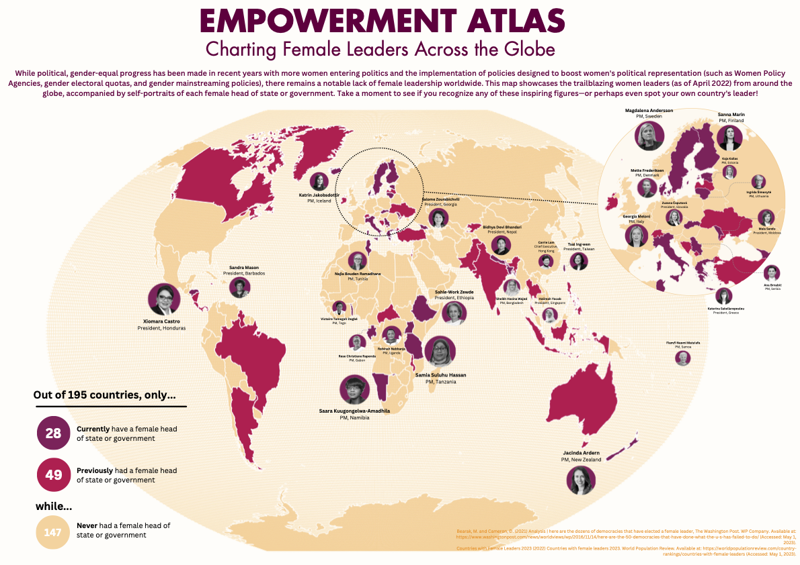
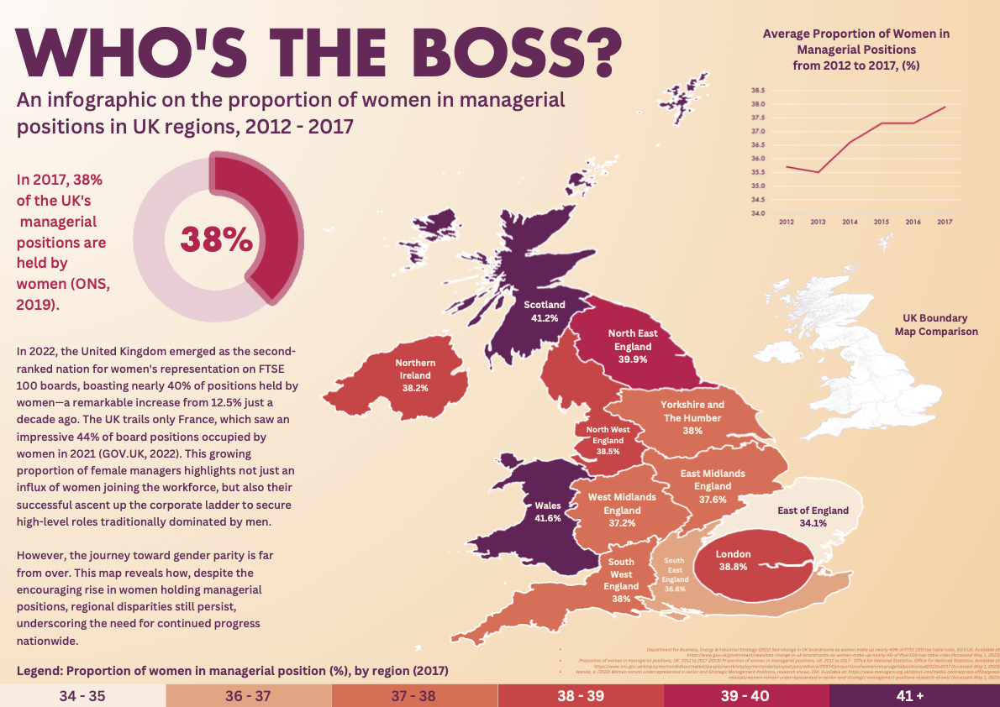
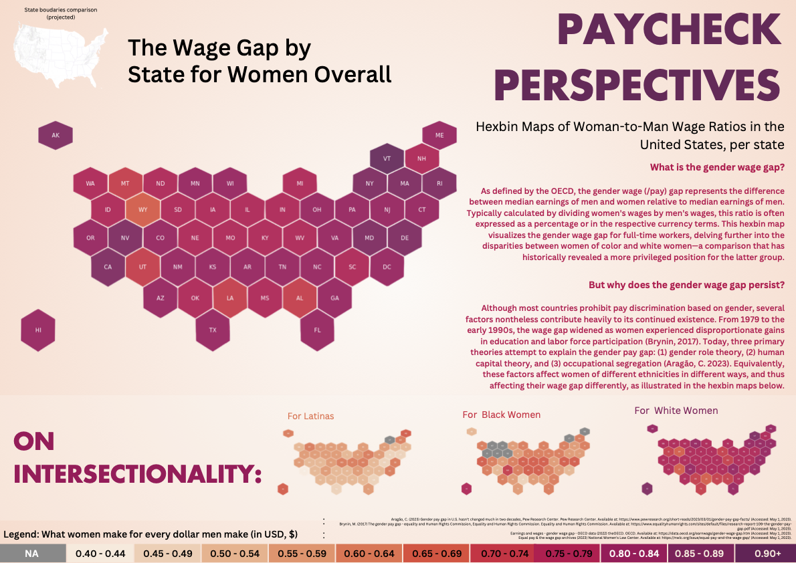
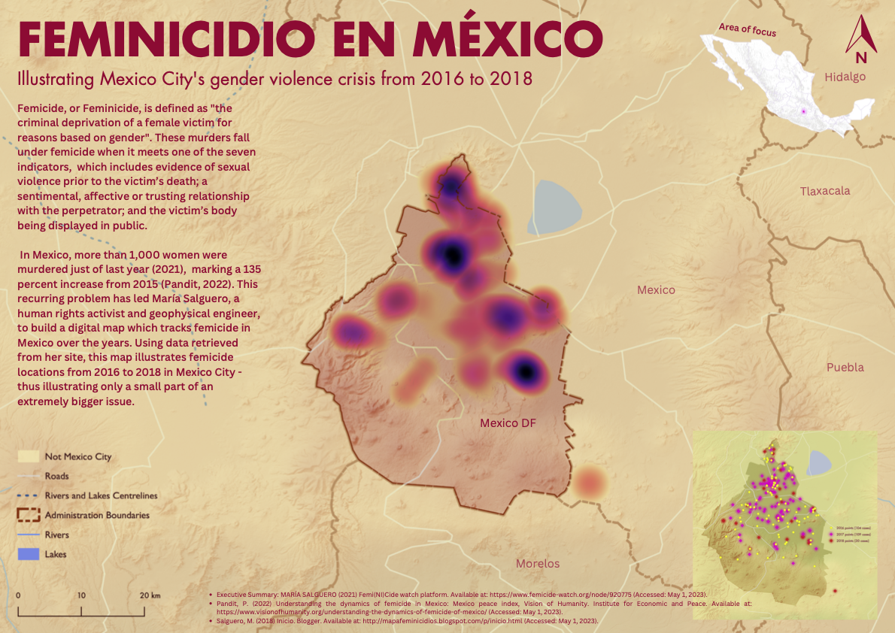

# geog0162-cartography-data-viz
Year 3 Cartography and Data Visualisation Module

This project showcases four major pieces I created for my cartography and visualization module.  
They explore leadership, gender representation, and intersectionality through visual storytelling.
The project also expects students to include introductory statements and a self-critique/reflection. I have include them below:

## Introduction

In the following maps, I have illustrated the progress (or lack thereof) in gender equality and women’s
rights around the world while simultaneously combining my skills in cartography and data visualisation. I
have done so in the following way: In the first map, Empowerment Atlas, I used data from World
Population Review and The Washington Post to illustrate countries with female leaders (i.e., head of state
or government) as of April 2022. Here, I applied my knowledge of projections and choropleth maps to
show the lack of female leaders. In the second map, Who’s the Boss? I showed the proportion of women
in managerial positions in the UK (2012-2017). Using data from the Office of National Statistics, I
combined my knowledge in data visualisation, coupled with colour theory to show the increase of women
in managerial positions and the difference in proportion per region. In the third map, Paycheck
Perspectives, I created four hexbin maps to show how women on average earn to men (per dollar). I have
retrieved the data from the National Women’s Law Center. Here, I not only showed the average
proportion per individual state, but also adopted an intersectionality stance, and illustrated how it differed
for women of different races/ethnicities. In the fourth map, Feminicidio en México, I illustrated the
persisting problem of gender-based violence, otherwise known as femicide or feminicide, in Mexico. I
retrieved the data from Salguero (2018). I have shown my understanding of heat maps, base maps,
projections, symbology, and colour theory in this map. Lastly, in Unseen Wounds, I have again used a
cartogram to show the proportion of women and girls aged 15 to 49 who have undergone FGM (per
country) coupled with a waffle chart. Although I picture this project to be in feminist publications such as
blogs, articles, or even posters, I believe most of these maps are readable to the general audience.
However, maps such as cartograms might need more personal research for them to understand their
function clearly. Nevertheless, I have provided enough supplementary text for most people to understand
what each map is about.

## Self-critique

In this project, I demonstrated my ability to apply the skills and knowledge gained in class, while also
extending beyond the course syllabus. This is evident in several ways: Map 1 highlights my graphic design
capabilities by incorporating profile pictures of female leaders in a consistent style and colour scheme and
using captions strategically as legends. In Map 2, I implemented the lessons from Week 8 on charts and
visualisations by integrating cartograms, a line graph, and a small reference terrain map. Map 3 showcases
my proficiency with hexbin maps. Additionally, across all maps, I sourced data beyond the class
recommendations while also utilising suggested basemap and shapefile resources. I maintained a consistent
typography and colour scheme throughout the maps, while also using the same terrain basemap format for
the reference mini maps. Lastly, I endeavoured to incorporate an intersectional feminist approach,
addressing various aspects of feminism.

However, there is room for growth. For instance, most data focus on Western countries, where gender
inequality is often less pronounced than in non-Western nations. This limitation stems from the scarcity
and incompleteness of gender inequality data in non-Western countries. Furthermore, I believe the
following would improve each individual map: I believe map 1 could be improved by adding more
statistical data and data visualisation to give the viewers more insight - this was something I had to
compromise in terms of space when using the portraits. In map 2, 3 and 5, I could further improve each
poster by incorporating more complex charts. For example, in the UK managerial map, instead of using a
regular donut chart and line graph, I could instead opt for a multi-layered donut chart which shows
proportional progress through the years. Lastly, map 4 could be enhanced by displaying point data
shapefiles on a street view basemap, as the city-based data would be more relevant. I attempted to
combine terrain and street map data, but the results were not seamless. In the future, exploring the
number of women beyond the executive branch, early suffragettes’ movement, and period poverty would
be valuable additions to this project.

## Reports

All final posters and essays are in the [`/reports`](reports/) folder:
- [Leaders.pdf](reports/1%20Leaders.pdf)
- [Manager.pdf](reports/2%20Manager.pdf)
- [Hexbin.pdf](reports/3%20Hexbin.pdf)
- [Feminicidio en México.pdf](reports/4%20Feminicidio%20en%20Me%CC%81xico.pdf)

---

## Figures

### 1. Leaders Map

### 2. Who’s the Boss?

### 3. Hexbin Wage Gap Map

### 4. Feminicidio en México

